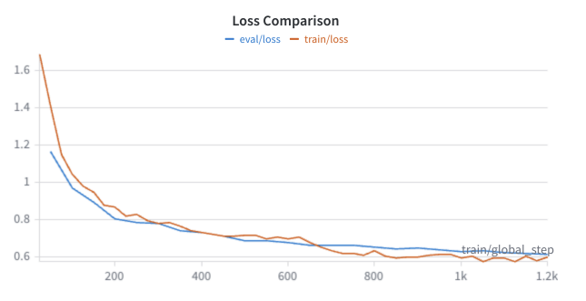

# FairestOfThemAll
Repository for Who is the Fairest of Them All?


Dataset by Barile et al., 2023: https://osf.io/5xbgf/overview

## LLM-as-judge prompts

```json
system_message = {
        'role': 'system',
        'content': """
        You are a participant in a scientific study. 
        You will be presented with four scenarios related to four different groups of people. 
        For each of them, a software system will produce recommendations on the basis of the preferences of the group members. 
        Please read carefully the description of each scenario, and then answer the questions. 

        The statements are to be answered using a 7-point Likert scale:
        -3: strongly disagree
        -2: disagree
        -1: somehwat disagree
        0: neither agree, neither disagree
        1: somewhat agree
        2: agree
        3: strongly agree

        You are to return ONLY a valid JSON object, with no explanations or extra text. 
        Do not include markdown formatting (no ```json). 
        The JSON must have the following structure:
        {{
        "fairness": your reply,
        "consensus": your reply,
        "satisfaction": your reply
        }}
                """
                }
```


## Fine-tuning Documentation

### Llama

Llama was fine-tuned using Supervised fine-tuning (SFT) with the transformers python package for four epochs. Data was split 80/20 training/test. The test set was used for evaluation during fine-tuning. Below is the training and evaluation loss.



#### Parameters:
lr =  1e-4
lora_alpha:32
lora_dropout:0.1
lora_rank:16
epochs = 4
per_device_eval_batch_size:2
per_device_train_batch_size:4
grad_accum: 4
max_seq_length: 1275 (calculated based on max length of samples)

Custom masking function (create_weighted_labels(input_ids, tokenizer, model_name)) to only calculate loss on assistant message, which was validated before running. Function created to also parse Olmo and Qwen tokenizers
e.g.,

Unmasked: 271 of a total of 1086 tokens


<details>
<summary>Click to expand data example in Chat format</summary>

```json
{"messages": [{"role": "system", "content": "You are a participant in a scientific study. You will be presented with scenarios where a software system makes recommendations based on group preferences. Evaluate the fairness, consensus, and satisfaction using a 7-point Likert scale (-3 to 3).\n\nThe statements are to be answered using a 7-point Likert scale:\n-3: strongly disagree\n-2: disagree\n-1: somewhat disagree\n0: neither agree, neither disagree\n1: somewhat agree\n2: agree\n3: strongly agree\n\n**Instructions:**\n- For each recommended restaurant, provide reasoning for fairness, consensus, and satisfaction.\n- Your reasoning should refer to the ratings given by individual members, highlighting trends, disagreements, or patterns, but you may describe them in natural language\u2014there is no need for a strict template.\n- The provided ratings are on a 1-5 star scale. (3 is average, above 3 is good, below 3 is bad.)\n- Discuss what aspects of the ratings or group history influence your judgment, and optionally mention what would improve fairness, consensus, or satisfaction.\n- Finally, provide integer scores for each dimension ranging from (and including) -3 (strongly disagree) to 3 (strongly agree).\n\n**Output format:**\n\n**Fairness reasoning:** [detailed explanation]\n\n**Consensus reasoning:** [detailed explanation]\n\n**Satisfaction reasoning:** [detailed explanation]\n\n**Scores:**  \nFairness: [score]  \nConsensus: [score]  \nSatisfaction: [score]\n"},{"role": "user", "content": "Assume that there is a group of friends. Every month, a group decision is made by these friends to decide on a restaurant to have dinner together. \nTo select a restaurant for the dinner next month, the group again has to take the same decision. \nIn this decision, each group member explicitly rated ten possible restaurants using a 5-star rating scale (1: the worst, 5: the best). \nThe ratings given by group members are shown in the table below:\n\n### BEGIN TABLE ###\n{'rest_1': [5, 1, 2, 4, 1], 'rest_2': [4, 4, 4, 2, 1], 'rest_3': [3, 5, 1, 2, 4], 'rest_4': [2, 4, 5, 1, 4], 'rest_5': [2, 5, 1, 4, 5], 'rest_6': [1, 1, 5, 5, 5], 'rest_7': [2, 4, 3, 1, 4], 'rest_8': [3, 3, 1, 5, 4], 'rest_9': [5, 1, 3, 1, 5], 'rest_10': [1, 5, 4, 4, 1]}\n### END TABLE ###\n\nThe group decided to avoid going in the same restaurant too often; hence, after a restaurant has been selected, it cannot be chosen again for the next 4 dinners. \n**The last 3 restaurants visited are: rest_5, rest_6, rest_4**.\nUsing the provided ratings, the system made a suggestion for the group on the basis of the preferences of all the group members.\n**rest_8** has been recommended to the group .\n\nIndicate your agreement to the following statements (7-point Likert scale ranging from -3 to 3):\n\n** 1.  Fairness **\nThe group recommendation is fair to all group members.\n\n** 2. Consensus **\nThe group members will agree on the group recommendation.\n\n** 3. Satisfaction **\nThe group members will be satisfied with regard to the group recommendation."},{"role": "assistant", "content": "Scores: \nFairness: -2\nConsensus: 1 \nSatisfaction: 1"}]}

```
</details>

Full dataset will be made available upon publication.
